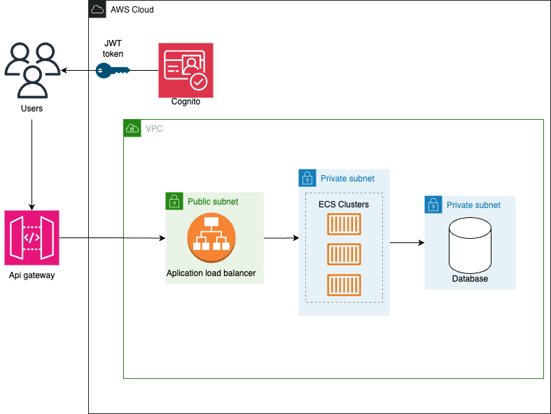

# User Management Service Design

## Introduction
The User Management Service is designed to handle the creation, retrieval, update, and deletion of users. 

## API Endpoints

### 1. Create User
- **Endpoint:** `/users`
- **Method:** `POST`
- **Description:** Creates a new user.
- **Request Body:**
    ```json
    {
        "username": "string",
        "email": "string",
        "password": "string"
    }
    ```
- **Response:**
    - **Success:** 201 Created with user data
    - **Error:** Appropriate HTTP status code with error message

### 2. User Login
- **Endpoint:** `/login`
- **Method:** `POST`
- **Description:** Authenticates a user and provides a token for accessing secured endpoints.
- **Request Body:**
    ```json
    {
        "username": "string",
        "password": "string"
    }
    ```
- **Response:**
    - **Success:** 200 OK with access token
    - **Error:** 401 Unauthorized with error message

### 3. Retrieve User
- **Endpoint:** `/users/{user_id}`
- **Method:** `GET`
- **Description:** Retrieves the details of a specific user.
- **Response:**
    - **Success:** 200 OK with user data
    - **Error:** Appropriate HTTP status code with error message

### 4. Update User
- **Endpoint:** `/users/{user_id}`
- **Method:** `PUT`
- **Description:** Updates the details of a specific user.
- **Request Body (example for updating email):**
    ```json
    {
        "email": "newemail@example.com"
    }
    ```
- **Response:**
    - **Success:** 200 OK with updated user data
    - **Error:** Appropriate HTTP status code with error message

### 5. Delete User
- **Endpoint:** `/users/{user_id}`
- **Method:** `DELETE`
- **Description:** Deletes a specific user.
- **Response:**
    - **Success:** 204 No Content
    - **Error:** Appropriate HTTP status code with error message

##  Database Structure Changes
Introducing the User Management feature necessitates changes in the database structure. A new `users` table 
and a `games` table update.

### Users Table
- **id:** Unique identifier for the user
- **username:** The username of the user
- **email:** The email address of the user
- **password:** The hashed password of the user
- **created_at:** The date and time when the user was created
- **updated_at:** The date and time when the user was last updated
- 
### Games Table Modification
The `games` table will now have a `user_id` foreign key to associate each game with a specific user.

- **user_id (FK):** References the `id` in the `users` table.

## Architectural Design Changes

### Microservices Adaptation
- **User Service:** Handles user operations and integrates with the Game Service.
- **Authentication Service:** Ensures secure login and token management.

### Security Enhancements
- **API Gateway:** Enhances security with request routing and rate limiting.
- **JWT Tokens:** Token-based user authentication.

### Scalability Considerations
- **Containerization:** Utilizes containers for scalability.
- **Load Balancing:** Distributes incoming traffic for stability.


#  Cloud microservices Design


# Components of the Tic Tac Toe Architecture

## 1. **User/Clients**
   -  End-users or clients interact with the Tic Tac Toe application. 

## 2. **API Gateway**
   - Serves as the entry point for the application's API. It handles API request routing and API composition.

## 3. **AWS Cognito**
   - A fully managed service that provides user identity and data synchronization. It helps in managing user registration, authentication, and account recovery.

## 4. **Application Load Balancer (ALB)**
   - **Description:** Distributes incoming application traffic across multiple targets. This increases the availability and fault tolerance of your application.

## 5. **Amazon ECS (Elastic Container Service)**
   - **Description:** A fully managed container management service that makes it easy to deploy, manage, and scale containerized applications. In this architecture, it's used to host and manage the Tic Tac Toe services.

## 6. **VPC (Virtual Private Cloud)**
   - **Description:** Provides a private network environment in the cloud where you can launch AWS resources in a virtual network that you define. It provides control over your virtual networking environment.

## 7. **RDS (Relational Database Service)**
   - **Description:** A fully managed relational database service.


